# SmartBlog — System Architecture Diagram

---

## 1. High-Level System Architecture

```mermaid
graph TB
    subgraph CLIENT["🖥️ Client Browser"]
        REACT["React 19 SPA<br/>(Vite + Tailwind CSS v4)"]
    end

    subgraph BACKEND["⚙️ Backend Server"]
        FASTAPI["FastAPI<br/>(Python, Uvicorn)"]
    end

    subgraph DATABASE["🗄️ Database"]
        MONGO[("MongoDB Atlas<br/>(users & posts collections)")]
    end

    subgraph EXTERNAL["🌐 External Services"]
        GEMINI["Google Gemini 2.0 Flash<br/>(AI API)"]
    end

    REACT -- "REST API (JSON)<br/>via Axios" --> FASTAPI
    FASTAPI -- "Motor (async)" --> MONGO
    FASTAPI -- "Streaming HTTP" --> GEMINI
    FASTAPI -- "StreamingResponse" --> REACT
```

---

## 2. Frontend Architecture

---

## 3. Backend Architecture

---

## 4. Authentication Flow

---

## 5. Auto-Save Flow

---

## 6. AI Feature Flow

---

## 7. Database Schema

---

## 8. Project File Tree

---

## 9. API Endpoint Map

```mermaid
graph LR
    subgraph AUTH_ROUTES["/api/auth"]
        A1["POST /signup"]
        A2["POST /login"]
        A3["GET /me 🔒"]
    end

    subgraph POST_ROUTES["/api/posts"]
        P1["POST / 🔒 Create draft"]
        P2["GET / 🔒 List my posts"]
        P3["GET /:id 🔒 Get post"]
        P4["PATCH /:id 🔒 Update post"]
        P5["POST /:id/publish 🔒 Publish"]
        P6["DELETE /:id 🔒 Delete"]
        P7["GET /public List published"]
        P8["GET /public/:id Read post"]
    end

    subgraph AI_ROUTES["/api/ai"]
        AI1["POST /generate<br/>(summary / fix grammar)"]
    end

    AUTH_ROUTES --- POST_ROUTES --- AI_ROUTES
```

> 🔒 = Requires JWT authentication

---

## 10. Deployment Architecture

